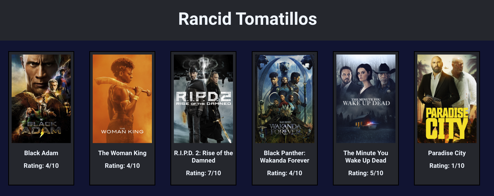
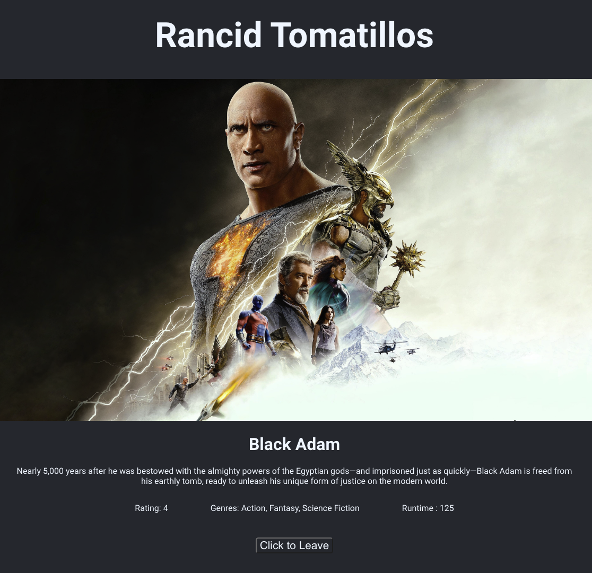

# Rancid Tomatoes

## Developed by:
  Matthew Shindel : <matthew@shindel.com> <https://github.com/MatthewShindel>
  Dan Lavery : <lavery_william@yahoo.com> <https://github.com/wlavery22>
  
### About this Application

This application is our first React Application that uses Fetch API to communicate with a server for information about recent movies. Our application uses React Router to allow the user to manuever through this webpage to see movies and their ratings. Users can click on a movie, and see more indepth information about that movie in a seperate url. A user can manuever back to their home page simply by clicking the button at the bottom of the webpage, or clicking the header. Initial stages of the project used conditional rendering to display different views to the user. After refactoring to use React Router, we removed the old logic that handeled the conditional rendering.

Futhermore, this application also comes with Cypress installed, and Cypress tests for the User if they want to test the application's consistency. The project also uses PropTypes, and has a responsive display to provide clear views across various devices including cell phones, tablets and PC's. Error messages are provided to the user in the case of incorrect URL's and server problems.

### Using this Application:

This application as a deployed link, located here:

If you wish to use this application locally, do the following:
1. Clone this repository
2. Cd into the respoitory
3. Run this application by using 'npm start'. This will open [http://localhost:3000](http://localhost:3000) to view it in your browser.

### Learning Goals
- Build our first App with React
- Learn to manage data flow, data manipulation, data storage and DOM rendering of data across multiple functional components
- Learn to use Cypress to test DOM rendering, fetch calls and error handling
- Understand and account for asynchronous Javascript within the App
- Create a single page App that looks and functions like a multi-page App using Router

### Wins and Challenges:
- Learned how to use React and Router to organize your components
- Used Cypress to test our application
- Successfully refactored our application multiple times throughout our development process.
- Finished Project significally ahead of schedule
- Learned about using conditional redering for error handling to display our error page if a fetch request fails due to the server being unavailable or being given a bad URL
